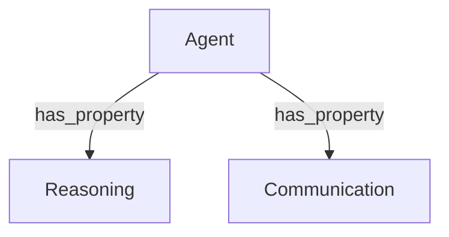

# AIQL Documentation

## 🧠 Knowledge Graph



## 📚 Agent

| Property | Target | Attributes |
|:---|:---|:---|
| <Reasoning> | - | - |
| <Communication> | - | - |

---

## ⚖️ Inference Rule
```aiql
// Logic representation placeholder
```

---

## ⚡ Task

| Subject | Relation | Object | Parameters |
|:---|:---|:---|:---|
| <System> | `[[performs]]` | <Optimization> | {"target":"database","method":"vacuum","timeout":"30s"} |

---
